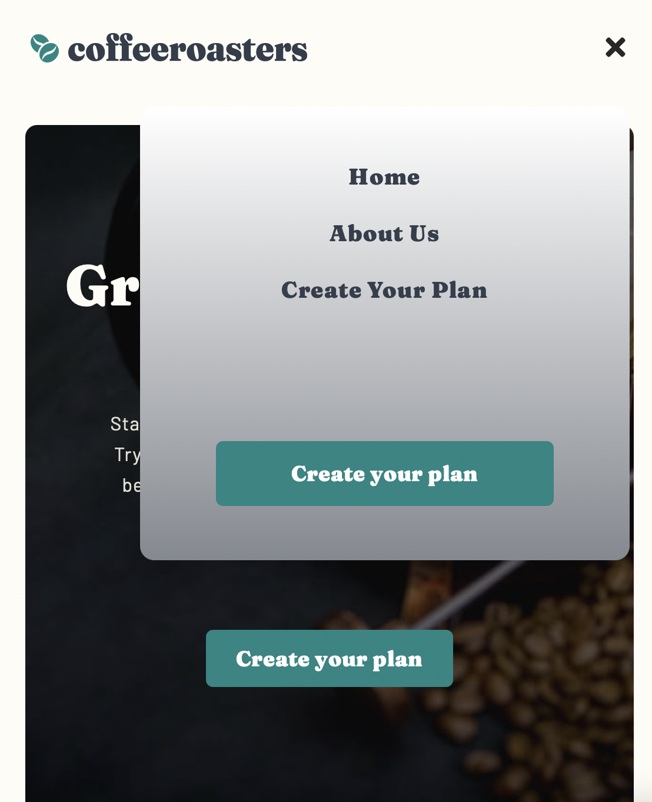
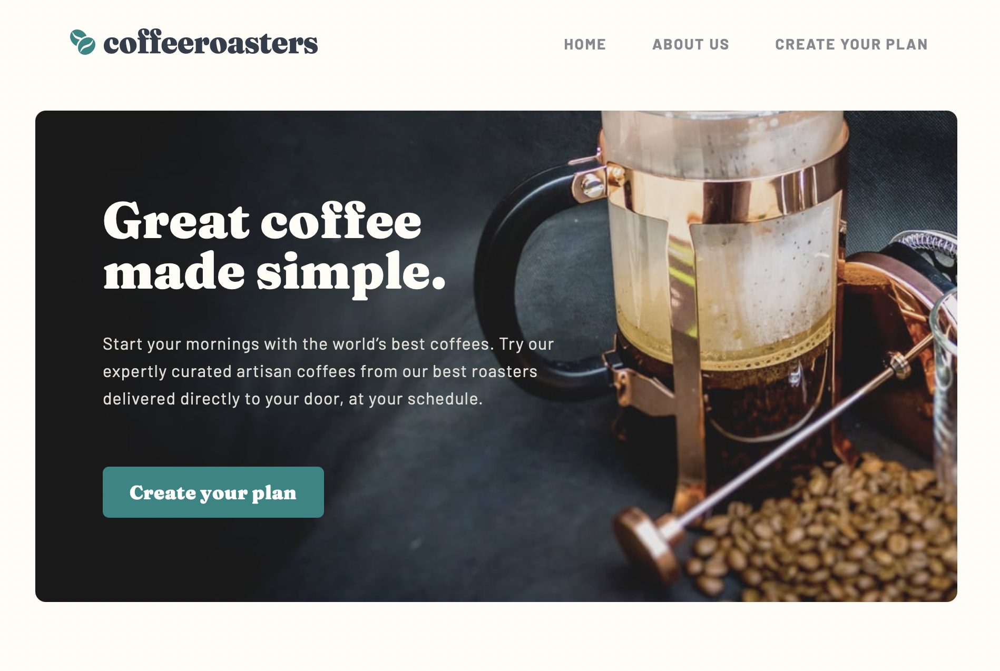
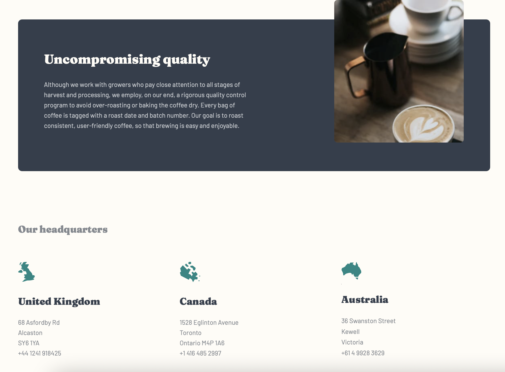
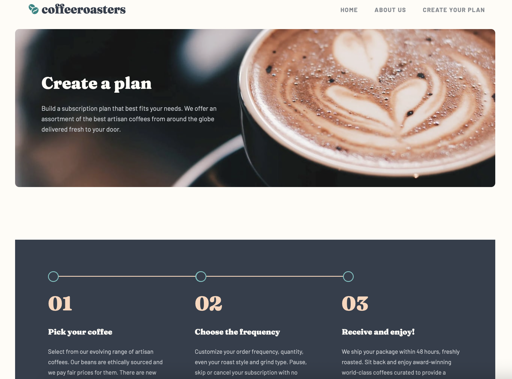
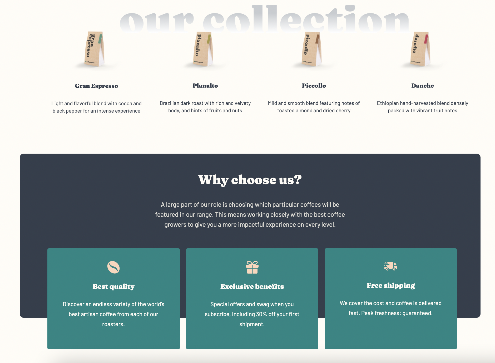
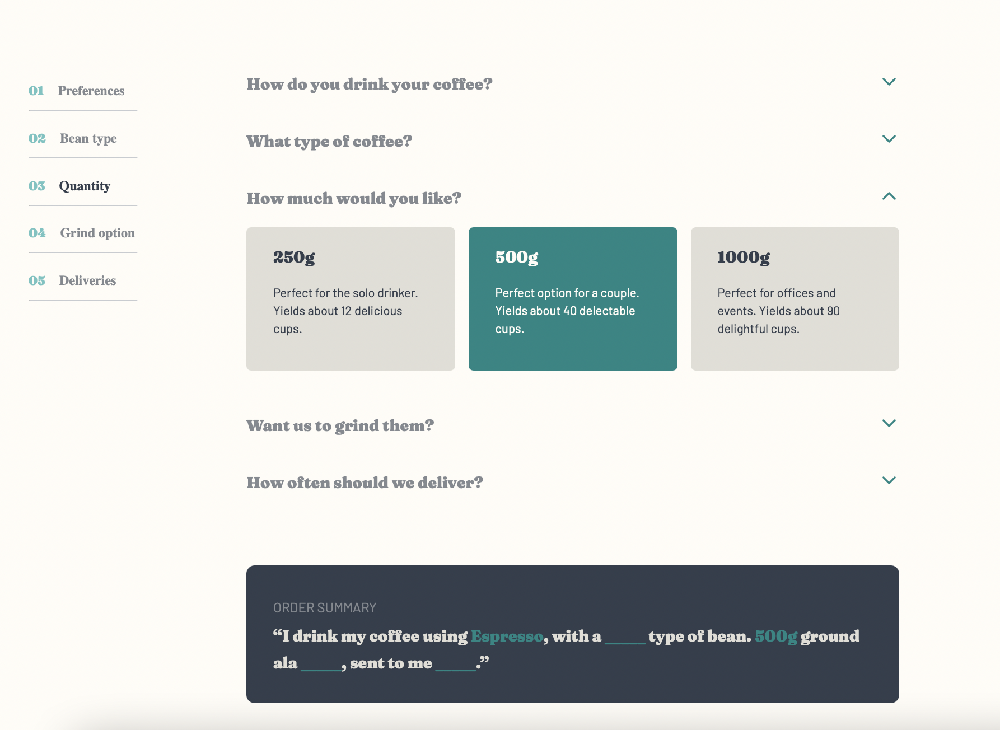
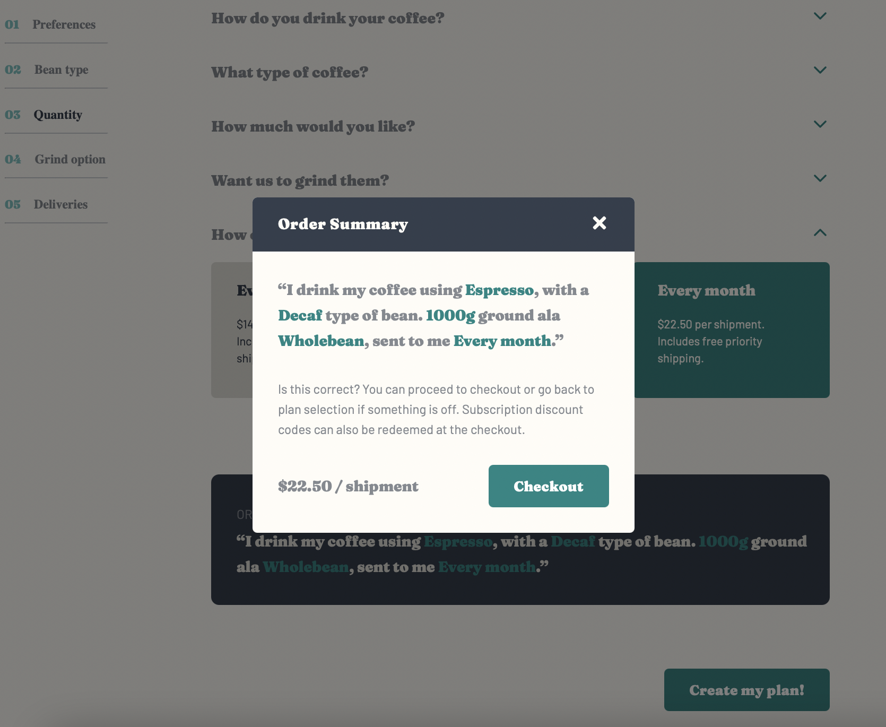

## Coffeeroasters subscription site // Frontend Mentor challenge // CSS and React

- [see project](https://sweta-coffeeroasters-subscription-site-fm.netlify.app)
- The project is a 3-page coffee subscription website. The user can create their coffee subscription plan by making the preferred selections. When they are ready with all of the selections and only then, they can see an order summary modal of their choices, which is ready to be checked out.

    

 

    

 

    

 

    

 

    

 

    

 

    

 
